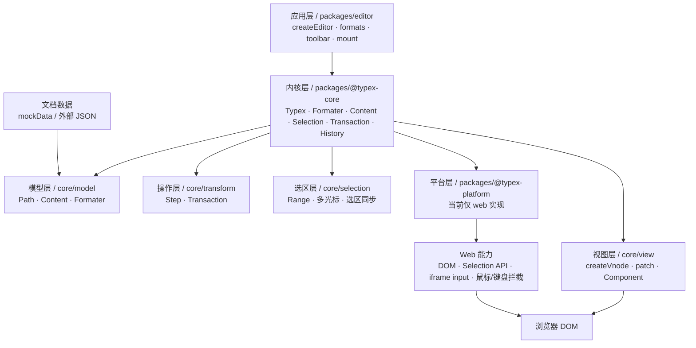
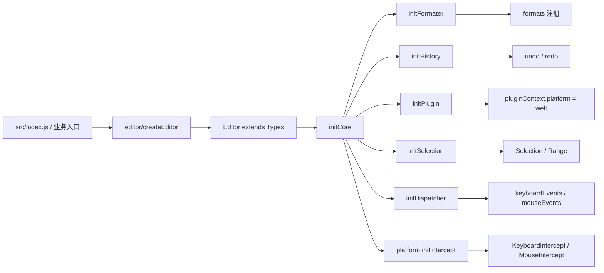
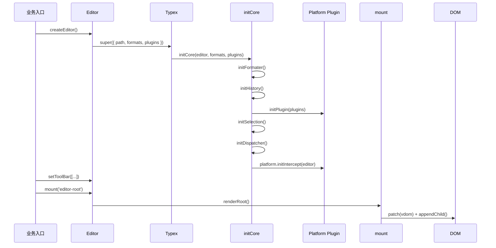
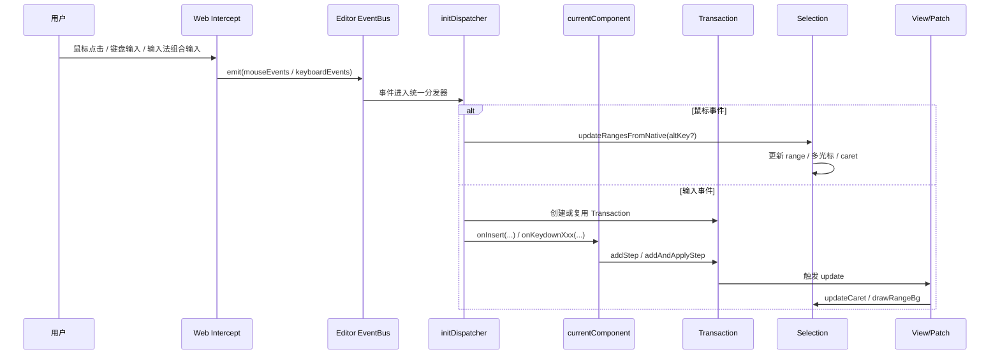
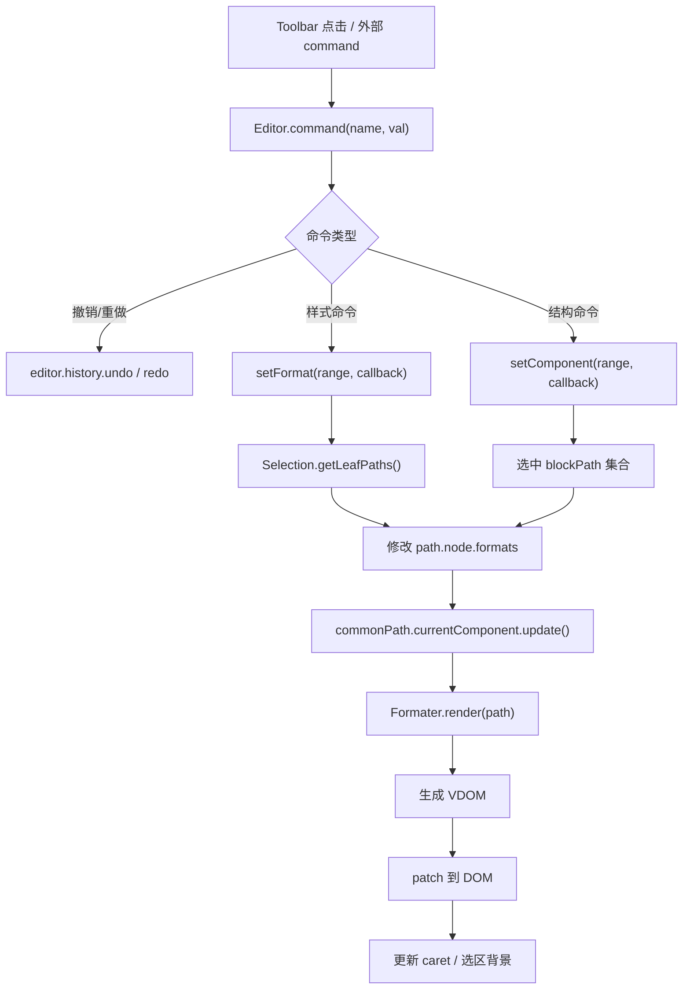
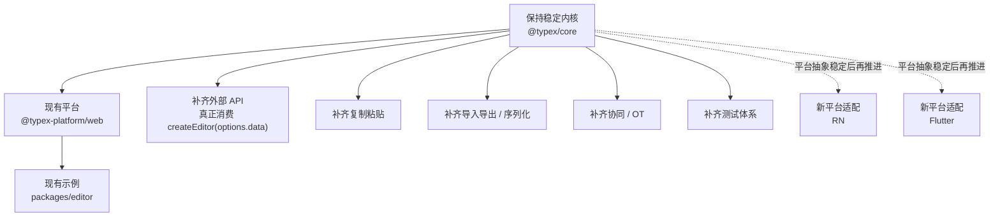

# Typex 项目梳理

## 1. 项目定位

Typex 不是一个“开箱即用”的富文本编辑器产品，而是一套**富文本编辑器内核 + 平台适配层 + 示例编辑器应用**。

它的核心目标是：

- 不依赖浏览器原生 `contentEditable`
- 不依赖 `document.execCommand`
- 用**自定义数据模型**驱动渲染与编辑行为
- 将**编辑器内核**与**平台能力**解耦
- 通过**格式系统 / 组件系统 / 原子化事务**实现可扩展编辑器框架

从代码结构上看，这个仓库更像是一个 **monorepo 形式的编辑器框架实验/实现项目**，而不是单一应用。

README 中对项目特点的概括与代码实现是基本一致的，尤其体现在以下方面：

- 自绘光标、模拟输入
- 支持多光标
- 组件化格式系统
- 平台层与内核层分离
- 数据驱动渲染

参考：`README.md:6`、`README.md:7`、`README.md:8`、`README.md:9`、`README.md:10`

---

## 2. 仓库结构总览

项目采用 pnpm workspace 管理，根包是一个 monorepo。

参考：`package.json:25`

### 2.1 根目录职责

- `package.json`：定义开发、构建、打包、文档生成脚本
- `src/index.js`：Demo 入口
- `index.html`：Demo 挂载容器
- `config/`：根级 webpack 配置
- `packages/`：核心包与示例应用

### 2.2 packages 下的关键模块

#### 1）`packages/@typex-core`
编辑器内核。

负责：
- 数据模型 `Path`
- 格式渲染 `Formater`
- 组件基类 `Content`
- 选区系统 `Selection`
- 事务与步骤 `Transaction / Step`
- 历史记录 `History`
- vdom 与 patch
- 默认编辑行为（移动、删除、换行等）

这是整套系统最核心的部分。

#### 2）`packages/@typex-platform`
平台适配层。

当前主要实现的是 **web 平台**，负责：
- DOM 创建与更新
- 原生 Selection 对接
- 鼠标事件拦截
- 键盘/输入法事件拦截
- 自定义输入承载
- 光标能力

#### 3）`packages/editor`
基于 core + platform 组装出来的一个 Demo 编辑器。

负责：
- 定义 formats
- 注入平台插件
- 提供 toolbar
- 挂载到页面
- 提供 mockData 示例文档

这是“如何使用 Typex”的最佳示例。

#### 4）`packages/babel-plugin-transform-typex-jsx`
自定义 JSX Babel 插件。

作用是把 JSX 转成 Typex 自己的 `h(...)` 调用，而不是 React/Vue 的运行时。

也就是说，这套系统有自己的轻量视图层和 JSX 编译链。

---

## 3. 这套项目怎么使用

从当前仓库状态看，最直接的使用方式有两种：

### 3.1 作为 Demo 项目运行

根目录脚本：

```bash
pnpm install
pnpm dev
```

对应脚本定义：

- `dev`：启动 webpack dev server
- `build`：构建 demo
- `jsdoc`：生成 API 文档
- `pack`：分别构建 core / platform / editor

参考：`package.json:3`-`package.json:13`

页面入口是：

- HTML 容器：`index.html:24`
- JS 入口：`src/index.js:9`

`src/index.js` 中的使用方式非常直观：

```js
window.editor = createEditor({
  data: 'hello world',
})
  .setToolBar(toolBar)
  .mount('editor-root')
```

参考：`src/index.js:23`-`src/index.js:28`

### 3.2 作为编辑器框架进行二次开发

如果把它当作框架使用，推荐理解为三步：

#### 第一步：构造编辑器实例
由 `packages/editor/index.js` 暴露 `createEditor` 工厂方法。

参考：`packages/editor/index.js:49`

#### 第二步：注册工具栏 / 指令
通过 `setToolBar([...])` 选择要启用的命令项。

参考：`packages/editor/index.js:31`-`packages/editor/index.js:41`

#### 第三步：挂载到 DOM
通过 `.mount('容器id')` 挂载到页面。

参考：`packages/editor/index.js:27`-`packages/editor/index.js:30`

---

## 4. 典型调用方式

当前 Demo 对外暴露的用法可以总结为：

```js
import createEditor from 'editor'

const editor = createEditor({
  data: 'hello world',
})

editor
  .setToolBar([
    'undo',
    'redo',
    'header',
    'fontSize',
    'color',
    'bold',
    'underline',
    'deleteline',
    'background',
  ])
  .mount('editor-root')
```

但要注意：**当前 `createEditor(options)` 并没有真正消费传入的 `options.data`**，而是直接使用 `mockData` 创建 path。

参考：`packages/editor/index.js:49`-`packages/editor/index.js:53`

这意味着：

- 当前示例 API 看起来支持外部传 data
- 但实际实现仍然固定从 `mockData` 初始化
- 所以这个 API 目前更偏“演示态”，还不是完整产品态

这是文档里需要明确指出的一个现状。

---

## 5. 项目初始化流程

整个编辑器启动流程可以概括为：

### 5.1 入口层
`src/index.js` 调用 `createEditor()`，再执行：

- `setToolBar(...)`
- `mount('editor-root')`

参考：`src/index.js:23`-`src/index.js:28`

### 5.2 Editor 组装层
`packages/editor/index.js` 中：

- `Editor` 继承 `Typex`
- 构造时传入 `formats`
- 注入 `plugins: [platform]`
- 绑定 command 事件

参考：`packages/editor/index.js:15`-`packages/editor/index.js:26`

### 5.3 Core 初始化层
`Typex` 构造函数中调用 `initCore(...)`，完成核心初始化：

- 初始化格式系统
- 初始化历史记录
- 初始化插件
- 初始化选区
- 初始化事件分发器
- 延迟初始化平台拦截器

参考：`packages/@typex-core/Typex.js:15`-`packages/@typex-core/Typex.js:24`

以及：`packages/@typex-core/initCore.js:21`-`packages/@typex-core/initCore.js:28`

### 5.4 插件安装层
平台插件 `@typex/platform` 的 `install()` 会：

- 把 core 注入平台上下文
- 把 web 能力挂到 `pluginContext.platform`
- 返回平台拦截初始化函数

参考：`packages/@typex-platform/index.js:6`-`packages/@typex-platform/index.js:10`

### 5.5 挂载层
`mount()` 中会：

- 构造根节点视图
- 渲染工具栏
- 渲染编辑内容
- 通过 `patch()` 生成真实 DOM
- append 到目标容器

参考：`packages/editor/mount.js:15`-`packages/editor/mount.js:31`

---

## 6. 核心调用流程梳理

这一部分是整套项目最值得讲清楚的内容。

---

### 6.1 数据流起点：Path 数据模型

Typex 的编辑内容不是直接依赖 DOM，而是先组织为一棵 `Path` 树。

在 Demo 里，初始文档来自 `mockData`，再通过 `createPath(marks)` 转成内部路径结构。

参考：`packages/editor/index.js:50`-`packages/editor/index.js:52`

`mockData` 的结构说明也很明确：

- `data` 表示内容
- `formats` 表示格式
- 整棵树以 `root` 包裹

参考：`packages/editor/data.js:8`、`packages/editor/data.js:9`-`packages/editor/data.js:506`

可以把它理解成：

```text
原始 JSON 数据 -> Path 树 -> 格式分组渲染 -> VDOM -> DOM
```

---

### 6.2 渲染流：Formater 驱动格式分组与视图生成

渲染入口是：

- `Typex.renderPath()` -> `formater.render({ children: [this.$path] })`

参考：`packages/@typex-core/Typex.js:25`-`packages/@typex-core/Typex.js:27`

`Formater` 的职责非常关键：

1. 注册所有 format 定义
2. 读取 path 上的 formats
3. 做“公共格式分组”
4. 生成 component/tag/attribute 三种类型的 vnode
5. 合并文本节点，减少冗余标签

参考：
- `packages/@typex-core/model/formater.js:17`-`packages/@typex-core/model/formater.js:21`
- `packages/@typex-core/model/formater.js:41`-`packages/@typex-core/model/formater.js:50`
- `packages/@typex-core/model/formater.js:95`-`packages/@typex-core/model/formater.js:184`
- `packages/@typex-core/model/formater.js:255`-`packages/@typex-core/model/formater.js:338`

#### 亮点 1：格式被分为三类

formats 定义里明确区分：

- `component`：块级/结构型组件，如 paragraph、header、table、image
- `tag`：标签包装，如 bold、underline、del
- `attribute`：属性型格式，如 color、fontSize、background

参考：`packages/editor/formats/index.js:1`-`packages/editor/formats/index.js:125`

这带来一个很大的好处：

- 结构型格式和样式型格式的职责分离
- 渲染时可以采用不同策略
- 扩展复杂内容块（如表格、图片、标题）更自然

#### 亮点 2：公共格式分组算法

`Formater._group()` 会抽取连续 path 的共同格式，然后按层递归生成结构。

它的目的本质上是：

- 尽量合并相邻、同格式的文本
- 尽量减少冗余嵌套
- 输出更干净的标签结构

这对应 README 提到的“无脏标签”。

参考：`packages/@typex-core/model/formater.js:255`-`packages/@typex-core/model/formater.js:338`

这是这套项目的一个明显技术亮点。

---

### 6.3 输入流：不依赖 contentEditable 的模拟输入机制

这是 Typex 最有辨识度的设计之一。

项目没有把编辑区域做成 `contenteditable`，而是：

- 在 web 平台层创建一个 iframe
- 在 iframe 内放一个 input
- 聚焦时把这个隐藏输入框移动到光标位置附近
- 所有键盘、输入法、组合输入事件都从这个 input/iframe 转发给 editor

参考：
- `packages/@typex-platform/web/intercept/keyboardIntercept.js:10`-`packages/@typex-platform/web/intercept/keyboardIntercept.js:20`
- `packages/@typex-platform/web/intercept/keyboardIntercept.js:21`-`packages/@typex-platform/web/intercept/keyboardIntercept.js:37`
- `packages/@typex-platform/web/intercept/keyboardIntercept.js:47`-`packages/@typex-platform/web/intercept/keyboardIntercept.js:67`

#### 亮点 3：输入与展示分离

这意味着：

- 展示层 DOM 不等于输入源
- 输入行为完全可控
- 不必受浏览器 contentEditable 差异牵制
- 可以自己处理中文输入法、组合输入、多光标等复杂场景

README 中“不依赖 contentEditable”“模拟输入”在代码里是真实现，而不是口号。

参考：`README.md:7`、`README.md:8`

---

### 6.4 事件流：平台拦截 -> Core 分发 -> 当前组件处理

编辑器事件处理链路非常清晰：

#### 鼠标事件链路

1. web 平台 `MouseIntercept` 监听 `mousedown / mouseup / selectionchange`
2. 转成 editor 事件：`mouseEvents`、`selectionchange-origin`
3. core 更新 Selection ranges
4. 再更新 caret / 拖蓝

参考：
- `packages/@typex-platform/web/intercept/mouseIntercept.js:23`-`packages/@typex-platform/web/intercept/mouseIntercept.js:40`
- `packages/@typex-platform/web/intercept/mouseIntercept.js:51`-`packages/@typex-platform/web/intercept/mouseIntercept.js:54`
- `packages/@typex-core/initCore.js:84`-`packages/@typex-core/initCore.js:94`
- `packages/@typex-core/initCore.js:147`-`packages/@typex-core/initCore.js:162`

#### 键盘事件链路

1. 平台层把 `keydown / keyup / input / composition*` 事件发给 editor
2. core 统一监听 `keyboardEvents`
3. 若是输入事件，走 `input()` 逻辑
4. 若是功能键，分发到当前 path 对应组件的 `onKeydownXxx` / `onXxx`

参考：
- `packages/@typex-platform/web/intercept/keyboardIntercept.js:56`-`packages/@typex-platform/web/intercept/keyboardIntercept.js:66`
- `packages/@typex-core/initCore.js:97`-`packages/@typex-core/initCore.js:145`

#### 亮点 4：事件按“当前组件”分发

`initCore` 里会根据当前 range 所在 path，调用：

- `path.currentComponent.onInsert(...)`
- `path.currentComponent.onKeydownArrowLeft(...)`
- `path.currentComponent.onKeydownEnter(...)`
- 以及其它 `on<Event>` 处理器

参考：`packages/@typex-core/initCore.js:114`-`packages/@typex-core/initCore.js:142`

这使得：

- 各种格式组件可以覆写自己的交互行为
- 表格、图片、段落、标题等可以拥有不同光标与输入逻辑
- 编辑器行为不是写死在全局，而是下沉到组件

这就是 README 中“组件是一等公民”的代码体现。

---

### 6.5 选区流：自定义 Range + 原生 Selection 同步

Typex 不是完全抛弃原生 Selection，而是采用“**内部 Range 为主，原生 Selection 为辅**”的策略。

`Selection` 负责：

- 从原生 selection 同步 ranges
- 支持多 range
- 更新光标位置
- 绘制拖蓝背景
- 在内容变更时修正 range 锚点
- 支持快照与恢复（服务于撤销/重做）

参考：
- `packages/@typex-core/selection/index.js:9`-`packages/@typex-core/selection/index.js:15`
- `packages/@typex-core/selection/index.js:181`-`packages/@typex-core/selection/index.js:188`
- `packages/@typex-core/selection/index.js:276`-`packages/@typex-core/selection/index.js:299`
- `packages/@typex-core/selection/index.js:362`-`packages/@typex-core/selection/index.js:374`
- `packages/@typex-core/selection/index.js:441`-`packages/@typex-core/selection/index.js:453`

#### 亮点 5：多光标支持是内建能力

Selection 中明确维护 `ranges = []`，并且支持：

- 从 native selection 扩增 range
- 光标去重
- alt 多选区扩展

参考：
- `packages/@typex-core/selection/index.js:10`
- `packages/@typex-core/selection/index.js:197`-`packages/@typex-core/selection/index.js:215`
- `packages/@typex-core/selection/index.js:323`-`packages/@typex-core/selection/index.js:354`

而鼠标层也显式支持 `altKey` 多 range 更新：

参考：`packages/@typex-platform/web/intercept/mouseIntercept.js:32`、`packages/@typex-platform/web/intercept/mouseIntercept.js:38`

这不是普通富文本 Demo 常见能力，是项目的重要亮点。

---

### 6.6 编辑操作流：组件行为 -> Step -> Transaction -> History

这是 Typex 的第二个核心亮点。

项目没有把编辑操作直接写成“修改 DOM”，而是走：

```text
用户操作 -> 组件方法 -> Step -> Transaction -> History -> 视图更新
```

#### Step
`Step` 表示可逆的原子操作。

内置有：
- `TextInsert`
- `TextDelete`
- `SplitText`
- `SetFormats`

参考：`packages/@typex-core/transform/step.js:7`-`packages/@typex-core/transform/step.js:148`

#### Transaction
`Transaction` 负责：
- 记录 steps
- 保存操作前 ranges 快照
- 提交后保存结束快照
- 支持 apply / rollback

参考：`packages/@typex-core/transform/transaction.js:9`-`packages/@typex-core/transform/transaction.js:109`

#### History
`History` 负责：
- 存储事务队列
- undo / redo
- 撤销后新操作覆盖未来分支

参考：`packages/@typex-core/history/index.js:8`-`packages/@typex-core/history/index.js:47`

#### 亮点 6：编辑行为天然可撤销/重做

因为所有操作都尽量建模为 Step/Transaction，所以：

- 撤销/重做容易落地
- 后续做协同编辑、OT、操作记录更有基础
- 行为层不是黑盒 DOM 变更，而是显式操作语义

这也是 README 中“原子化 API”的底层支撑。

---

## 7. Content 组件模型：为什么说“组件是一等公民”

`Content` 是内容组件基类，几乎所有核心交互都在这里给出了默认实现：

- `onInsert`
- `onContentDelete`
- `onCaretMove`
- `onLinefeed`
- `onKeydownArrowLeft/Right/Up/Down`
- `onKeydownBackspace`
- `onKeydownEnter`
- `setFormat`
- `setComponent`

参考：`packages/@typex-core/model/content.js:14`-`packages/@typex-core/model/content.js:484`

这意味着自定义组件时，不只是“定义渲染长什么样”，还可以定义：

- 光标如何进入/离开这个组件
- 删除时怎么处理结构
- 回车时怎么拆分
- 格式如何应用到选区
- 块级组件如何变更

这是这套系统相比传统“基于 DOM patch 的富文本工具栏封装”更底层、更框架化的地方。

---

## 8. Toolbar 命令调用流程

工具栏并不是直接操作 DOM，而是走 editor command 机制。

### 8.1 配置阶段
工具栏选项定义在：

- `packages/editor/toolBar/toolBarOptions.js`

每个工具项包含：
- `name`
- `icon`
- `tooltip`
- `commandHandle`

参考：`packages/editor/toolBar/toolBarOptions.js:2`-`packages/editor/toolBar/toolBarOptions.js:113`

### 8.2 注册阶段
`Editor.setToolBar()` 会：

- 过滤出启用的工具项
- 为每个工具缓存 `commandHandle`
- 建立 name -> commandHandle 的映射

参考：`packages/editor/index.js:31`-`packages/editor/index.js:41`

### 8.3 调用阶段
当 editor 收到 `command` 事件时：

- 根据 name 找到 commandHandle
- 执行对应逻辑

参考：`packages/editor/index.js:43`-`packages/editor/index.js:47`

### 8.4 命令本质
例如：

- `undo/redo` 调用 history
- `bold/underline/color/fontSize/background` 调用 `setFormat`
- `header` 调用 `setComponent`

参考：`packages/editor/toolBar/toolBarOptions.js:3`-`packages/editor/toolBar/toolBarOptions.js:112`

#### 亮点 7：命令和编辑行为是解耦的

工具栏只是命令入口，真正的格式应用和结构变更仍然下沉到：

- Selection
- Content
- Path
- Transaction

因此后续完全可以把 toolbar 替换成：

- 快捷键命令面板
- slash command
- 右键菜单
- 外部 API 调用

只要统一发 command 即可。

---

## 9. JSX / 视图层设计亮点

这个项目不是 React，也不是 Vue，但借用了 JSX 作为描述视图的语法糖。

自定义 Babel 插件会把：

```jsx
<div class='editor-wrappe'>...</div>
```

转成：

```js
h('div', { class: 'editor-wrappe' }, [...children])
```

参考：`packages/babel-plugin-transform-typex-jsx/index.js:85`-`packages/babel-plugin-transform-typex-jsx/index.js:112`

同时，这个插件还会自动在存在 JSX 的函数作用域里注入 `h`。

参考：`packages/babel-plugin-transform-typex-jsx/index.js:9`-`packages/babel-plugin-transform-typex-jsx/index.js:50`

#### 亮点 8：自有轻量视图层

这说明项目具备：

- 自定义 JSX 编译能力
- 自己的 vnode 创建与 patch 机制
- 对组件渲染路径的完整控制

对于一个编辑器框架来说，这种“渲染层自控”是很重要的，因为编辑器往往需要比通用 UI 框架更细的 DOM/Selection 控制。

---

## 10. 适合怎么理解这套系统

如果要给团队或读者一个最清晰的理解方式，我建议把这套项目定义成：

> **Typex = 一个面向富文本编辑器构建的底层框架。**
>
> 它把“内容结构、格式系统、编辑行为、选区系统、事务历史、平台适配、视图渲染”拆成了清晰分层，目标是构建一个比 contentEditable 更可控、更可扩展的编辑器体系。

可以把它的分层理解成：

```text
应用层（editor）
  ├─ toolbar / formats / mount / demo
  ↓
内核层（@typex/core）
  ├─ Typex
  ├─ Formater
  ├─ Content
  ├─ Selection
  ├─ Transaction / Step
  ├─ History
  └─ VDOM / Patch
  ↓
平台层（@typex/platform）
  ├─ web DOM
  ├─ selection bridge
  ├─ mouse intercept
  ├─ keyboard intercept
  └─ caret
```

### 10.1 Mermaid 架构图（研发理解版）

下面这张图适合研发团队先建立“模块边界感”。



### 10.2 Mermaid 模块依赖图（便于后续拆分迭代）

这张图更适合研发评估“修改一个模块会影响哪里”。



### 10.3 Mermaid 启动初始化流程图

这张图回答“编辑器从创建到可编辑，中间发生了什么”。



### 10.4 Mermaid 输入与编辑事件流程图

这张图适合研发理解“为什么它不依赖 contentEditable 仍能编辑”。



### 10.5 Mermaid 格式应用与事务链路图

这张图适合理解 toolbar 命令、格式系统和事务系统是如何串起来的。



### 10.6 Mermaid 后续迭代建议图

这张图不是当前代码图，而是给研发做 roadmap 时看的“怎么演进更稳”。



### 10.7 研发阅读建议

如果研发要基于这套代码继续迭代，建议按下面顺序理解：

1. 先看 `packages/editor/index.js`，理解如何组装一个 Editor
2. 再看 `packages/@typex-core/Typex.js` 和 `initCore.js`，理解初始化入口
3. 再看 `selection/index.js`，理解选区和多光标
4. 再看 `model/content.js`，理解默认编辑行为
5. 再看 `model/formater.js`，理解格式系统与渲染
6. 最后看 `transform/step.js`、`transaction.js`、`history/index.js`，理解可逆操作链

如果要做需求迭代，也建议按下面优先级推进：

- 第一优先级：补齐外部 API 与数据初始化链
- 第二优先级：补齐复制粘贴、序列化、命令系统
- 第三优先级：补齐测试与稳定性
- 第四优先级：评估协同编辑
- 第五优先级：评估 RN / Flutter 平台适配

---

## 11. 项目亮点总结

### 亮点 1：彻底摆脱 contentEditable
输入、光标、选区、渲染都尽量自己控制，避免浏览器差异带来的不确定性。

### 亮点 2：内核与平台解耦
`@typex/core` 与 `@typex/platform` 分离，为跨平台留出了架构空间。

### 亮点 3：组件即行为单元
组件不仅决定渲染，还决定输入、删除、移动、换行等交互逻辑。

### 亮点 4：原子事务模型
编辑操作抽象为 `Step -> Transaction -> History`，为撤销/重做和未来协同能力打基础。

### 亮点 5：多光标内建
不是后补功能，而是从 Selection 设计开始就支持多 range。

### 亮点 6：格式系统层次清晰
`component/tag/attribute` 三类格式，把结构和样式区分开，扩展性更强。

### 亮点 7：标签最简化思路
`Formater` 的公共格式分组算法有明显的“去冗余嵌套”设计意图。

### 亮点 8：自有 JSX + VDOM 体系
说明作者追求的是编辑器全链路控制，而不是简单封装现成 UI 框架。

---

## 12. 当前使用层面的不足与现状

从代码现状看，这个项目很有想法，但仍偏“内核探索 / Demo 演示”阶段，主要体现在：

### 12.1 createEditor 的外部参数未完全打通
`createEditor(options)` 当前没有实际消费 `options` 中传入的数据，而是直接使用 `mockData`。

参考：`packages/editor/index.js:49`-`packages/editor/index.js:53`

### 12.2 README 中 TODO 仍较多
README 明确写了待完善项：

- 协同编辑
- 历史记录
- 复制粘贴
- API 优化

参考：`README.md:111`-`README.md:116`

另外 `mockData` 中也提到：

- 原子化操作完成度约 40%
- 协同有方案但未开发

参考：`packages/editor/data.js:312`-`packages/editor/data.js:360`

### 12.3 更适合“框架研究 / 内核扩展”而非直接商用落地
现阶段这套代码最适合：

- 学习富文本编辑器底层实现
- 作为自定义编辑器内核的实验基础
- 在此基础上继续补完 API、组件库、粘贴、序列化、协同等能力

---

## 13. 推荐文档表达方式

如果你后续要把这套项目介绍给别人，建议用下面这段话作为摘要：

### 一句话介绍

Typex 是一套基于自定义数据模型、事务系统和平台适配层实现的富文本编辑器框架，核心特点是不依赖 `contentEditable`，通过模拟输入、自绘光标、组件化格式系统和原子化编辑操作，实现高可控、高扩展的编辑体验。

### 适合放在文档首页的简介

Typex 将富文本编辑器拆分为三层：

- `@typex/core`：编辑器内核，负责数据结构、格式渲染、选区系统、事务和历史记录
- `@typex/platform`：平台适配层，负责 DOM、Selection、输入与事件拦截
- `editor`：示例应用，展示如何定义格式、挂载编辑器和接入工具栏

它最大的特点是不依赖浏览器原生 `contentEditable`，而是通过内部数据结构和平台拦截机制实现输入、选区和渲染控制，因此更适合构建高度定制的富文本编辑器。

---

## 14. 快速上手说明（可直接给使用者）

### 安装依赖

```bash
pnpm install
```

### 启动示例

```bash
pnpm dev
```

### 构建

```bash
pnpm build
```

### 构建各子包

```bash
pnpm pack
```

### 代码中的最小使用方式

```js
import createEditor from 'editor'

const editor = createEditor()
editor
  .setToolBar(['undo', 'redo', 'bold', 'underline', 'color'])
  .mount('editor-root')
```

> 注意：当前默认初始化内容来自 `packages/editor/data.js` 中的 `mockData`，不是外部传入数据。

---

## 15. 平台支持情况说明

这一节专门回答“这套项目现在能跑在哪些平台上”。

### 15.1 当前明确可用的平台

#### 1）H5 / 浏览器 Web
当前代码是明确支持浏览器环境的，这也是项目当前唯一已经实现完成的平台。

原因是 `@typex-platform` 当前直接注入的是 `web` 能力：

参考：`packages/@typex-platform/index.js:1`-`packages/@typex-platform/index.js:11`

并且 web 平台里直接依赖了浏览器 DOM 与 Selection：

- `document`
- `window`
- `document.getSelection()`
- `document.createRange()`
- `iframe`
- `input`

参考：
- `packages/@typex-platform/web/index.js:1`-`packages/@typex-platform/web/index.js:14`
- `packages/@typex-platform/web/intercept/keyboardIntercept.js:10`-`packages/@typex-platform/web/intercept/keyboardIntercept.js:20`
- `packages/@typex-platform/web/intercept/mouseIntercept.js:9`-`packages/@typex-platform/web/intercept/mouseIntercept.js:18`
- `packages/@typex-core/selection/index.js:11`

所以当前可以明确得出：

> Typex 目前是一个 **Web/H5 编辑器内核 + Web 平台实现**。

#### 2）Vue
Vue 可以使用，但要注意：

- 可用的前提是 **运行在浏览器里**
- 本质上不是“Vue 原生编辑器框架”
- 而是“在 Vue 页面中挂载一个基于 DOM 的 Typex 编辑器实例”

也就是说，Vue 对 Typex 来说更多是**宿主框架**，不是它的原生运行时。

#### 3）Electron Renderer
如果是在 Electron 的渲染进程里，也就是加载 HTML/DOM 页面那一层，理论上可以使用。

因为 Electron Renderer 本质上也是 Chromium Web 环境，具备：

- DOM
- Selection API
- iframe/input
- 鼠标/键盘事件体系

所以：

- **Electron 页面内使用：可以尝试落地**
- **Electron 原生层直接复用当前平台实现：不行**

---

### 15.2 当前不能直接使用的平台

#### 1）React Native
当前不能直接使用。

原因：

- 没有 DOM
- 没有浏览器 Selection/Range API
- 没有 iframe + input 这套输入承载机制
- 鼠标/键盘/文本输入模型与 Web 完全不同

#### 2）Flutter
当前也不能直接使用。

原因：

- Flutter 不是 DOM 渲染体系
- 文本编辑、选区、输入法、RichText 都是 Flutter 自己的 runtime/widget 能力
- 现有 `web` 平台代码几乎无法直接复用

---

### 15.3 平台支持结论表

| 平台 | 当前是否可直接使用 | 说明 |
|---|---|---|
| H5 / 浏览器 | 可以 | 当前主支持平台 |
| Vue | 可以 | 作为浏览器页面中的宿主框架使用 |
| Electron Renderer | 基本可以 | 本质仍然是 Web 环境 |
| React Native | 不可以 | 缺少 DOM / Selection / iframe 输入体系 |
| Flutter | 不可以 | 缺少 Web 平台基础设施 |

---

## 16. 多端适配可行性评估

从架构设计上看，这个项目**有跨平台思路**，但从实现完成度看，**目前只有 Web 平台落地**。

### 16.1 为什么说它“有跨平台思路”

因为它把：

- 内核能力放在 `@typex/core`
- 平台能力放在 `@typex/platform`

这说明作者已经有意把“编辑器规则”和“平台能力”分层。

参考：`packages/@typex-platform/index.js:6`-`packages/@typex-platform/index.js:10`

从架构方向上，这是对的。

### 16.2 为什么说它“还不是多端现成方案”

因为当前 `platform` 实际只实现了 `web`：

- DOM 创建
- DOM patch
- 浏览器 Selection 桥接
- iframe 输入代理
- 鼠标/键盘拦截
- Web 光标绘制

这些能力都深度绑定浏览器运行时。

所以当前项目并不能说“RN / Flutter / Electron / H5 一套代码通吃”。

它更准确的状态是：

> **内核有跨平台抽象方向，但平台实现目前只有 Web。**

### 16.3 如果要支持 RN / Flutter，需要补什么

如果后续真要走多端，建议保持 `@typex/core` 作为统一内核，然后分别实现新的平台适配层，例如：

- `@typex-platform-web`
- `@typex-platform-rn`
- `@typex-platform-flutter`
- `@typex-platform-electron`（如果想做更细的 Electron 特化）

每个平台至少都要补齐这些能力：

1. 渲染挂载能力
   - 把 vnode / component 结果渲染到目标平台视图层

2. 选区桥接能力
   - 把内核 Range 与平台原生选区系统同步

3. 输入桥接能力
   - 把键盘输入、输入法组合输入、删除、回车等事件转成统一内核事件

4. 光标能力
   - 绘制光标、更新位置、处理多光标

5. 事件拦截能力
   - 鼠标/触摸/键盘/焦点等事件统一分发给 core

其中最难的往往不是渲染，而是：

- 选区同步
- 输入法组合输入
- 多光标
- 跨组件光标移动

也就是说，RN / Flutter 不是“改几个适配器文件”就能接上，而是需要一套完整平台层实现。

---

### 16.4 对你们当前技术栈的落地建议

如果你们现在有：

- RN
- Electron
- Flutter
- H5
- Vue

那建议这样评估：

#### 建议优先落地的平台
- H5
- Vue Web
- Electron Renderer

这三类都能复用现有 Web 平台能力。

#### 不建议当前直接承诺的平台
- React Native
- Flutter

因为这两类需要额外建设平台层，投入明显更大。

#### 更现实的结论
如果你们想尽快验证 Typex 的产品能力，最适合先做：

- Web 编辑器
- Vue 页面接入
- Electron 桌面版 Web 容器接入

如果后续确认编辑器能力值得长期投入，再考虑抽象与建设 RN / Flutter 平台层。

---

## 17. 研发改造建议（可直接用于排期）

这一节不是介绍现状，而是面向“接下来怎么改”。

目标是帮助研发团队快速回答三个问题：

1. 第一阶段先改什么，收益最大？
2. 哪些文件是关键落点？
3. 哪些风险要提前规避？

---

### 17.1 总体改造原则

建议遵循三条原则：

#### 原则 1：先补“可用性”，再补“先进能力”
优先补：

- 外部数据初始化
- 基础 API
- 复制粘贴
- 序列化
- 测试

后补：

- 协同编辑
- 多端平台
- 更复杂组件体系

原因很简单：如果基础能力没打通，即使内核设计再先进，也很难进入真实业务。

#### 原则 2：尽量稳定 `@typex/core` 的抽象边界
`@typex/core` 是未来最可能复用的资产。

改造时应优先避免：

- 在 editor 层堆业务逻辑
- 在 platform/web 中写死过多业务规则
- 把 path / selection / transaction 的职责打散

#### 原则 3：先把 Web 做完整，再谈跨端
当前平台实现只有 Web，最现实的路线是：

- 先让 Web 具备业务接入能力
- 再把平台抽象做稳
- 最后评估 RN / Flutter 适配

---

### 17.2 分阶段迭代建议

#### 第一阶段：补齐可接入能力（建议最高优先级）

目标：让 Typex 从“Demo 可跑”变成“业务可接入”。

##### 第一阶段重点任务

1. 打通 `createEditor(options)`
   - 真正消费外部 `data`
   - 支持外部 formats / plugins / toolbar 配置
   - 不再强依赖 `mockData`

2. 抽离 Demo 逻辑
   - 把 `packages/editor/data.js` 的演示数据与核心初始化解耦
   - 让 editor 成为可配置实例，而不是固定 demo

3. 整理对外 API
   - `getValue()`
   - `setValue(data)`
   - `focus()`
   - `destroy()`
   - `execCommand(name, value)`
   - `registerFormat()` / `registerPlugin()`（如有需要）

4. 明确初始化协议
   - 输入数据格式
   - 输出数据格式
   - toolbar 配置格式
   - command 命令协议

##### 第一阶段关键文件

- `packages/editor/index.js`
- `packages/editor/data.js`
- `packages/@typex-core/Typex.js`
- `packages/@typex-core/index.js`
- `packages/@typex-core/model/path.js`

##### 第一阶段预期结果

完成后，研发应能做到：

- 从业务侧传入 JSON 文档
- 正常初始化编辑器
- 从编辑器中读取当前内容
- 通过 API 驱动命令执行
- 不依赖 demo 数据也能工作

---

#### 第二阶段：补齐业务常用基础能力

目标：让编辑器具备最基本的业务落地条件。

##### 第二阶段重点任务

1. 复制粘贴
   - 支持纯文本粘贴
   - 支持基础富文本粘贴策略
   - 明确粘贴过滤规则

2. 序列化 / 反序列化
   - JSON -> Path
   - Path -> JSON
   - 如有需要，再扩展 HTML 导入导出

3. 命令系统标准化
   - command 入参规范化
   - toolbar 与外部 command 统一协议
   - 命令结果和副作用更可预测

4. 历史记录稳定性补强
   - undo / redo 边界行为验证
   - 输入法与事务提交边界验证
   - 多选区场景下事务恢复验证

##### 第二阶段关键文件

- `packages/editor/toolBar/toolBarOptions.js`
- `packages/@typex-core/history/index.js`
- `packages/@typex-core/transform/transaction.js`
- `packages/@typex-core/transform/step.js`
- `packages/@typex-core/selection/index.js`
- `packages/@typex-platform/web/intercept/keyboardIntercept.js`

##### 第二阶段预期结果

完成后，研发应能做到：

- 把编辑器真正嵌入业务表单或页面
- 拿到稳定的输入输出数据
- 支持最基本的复制粘贴与撤销重做
- 初步具备线上试点条件

---

#### 第三阶段：补齐工程化与稳定性

目标：让这套系统进入“可持续维护”状态。

##### 第三阶段重点任务

1. 建立测试体系
   - model 层单元测试
   - selection / transaction 单元测试
   - editor 初始化与命令集成测试
   - 输入法与多光标关键路径测试

2. 清理不稳定实现
   - 去掉调试日志
   - 清理 demo 残留逻辑
   - 补齐异常路径处理

3. 整理文档
   - 核心数据结构文档
   - command 协议文档
   - format 扩展文档
   - 平台适配接口文档

##### 第三阶段关键文件

- `packages/@typex-core/model/*`
- `packages/@typex-core/selection/*`
- `packages/@typex-core/transform/*`
- `packages/@typex-platform/web/*`
- 根目录 `README.md`

##### 第三阶段预期结果

完成后，研发应能做到：

- 稳定扩展新格式
- 稳定定位编辑问题
- 对回归风险有基本控制
- 支撑多人协作维护

---

#### 第四阶段：评估高级能力

目标：在基础能力稳定后，再进入高投入模块。

##### 可以在第四阶段考虑的能力

- 协同编辑 / OT / CRDT
- 更丰富的块级组件
- Markdown/HTML 互转
- 平台抽象再设计
- RN / Flutter 适配预研

这一阶段不建议过早启动，否则会把还没稳定的基础层一起拖复杂。

---

### 17.3 最推荐的第一批改造清单

如果现在就要开干，我建议第一批只做下面 6 件事：

1. 让 `createEditor(options.data)` 真正生效
2. 增加 `getValue()` / `setValue()`
3. 抽离 `mockData` 默认逻辑
4. 统一 `execCommand()` 调用入口
5. 补最基础 JSON 序列化能力
6. 为 selection / transaction / history 补测试

这是最小但最关键的一组改造。

---

### 17.4 建议的任务拆分方式

如果按研发排期拆任务，建议按模块拆，而不是按“页面功能”拆。

#### 模块 A：初始化与外部 API
- 打通 createEditor 入参
- 增加 get/setValue
- 增加 destroy/focus/execCommand

#### 模块 B：数据模型与序列化
- 明确 JSON schema
- 补导入导出
- 保证 Path 构建与输出一致

#### 模块 C：命令与工具栏
- 统一命令协议
- 让 toolbar 只做 UI，不做核心逻辑耦合

#### 模块 D：输入与选区稳定性
- 输入法
- 多光标
- undo/redo
- 跨组件移动

#### 模块 E：工程化
- 测试
- 文档
- demo 与库解耦

这样拆的好处是：

- 依赖关系清楚
- 能并行推进
- 后续也利于多人协作

---

### 17.5 风险点提示

研发在改造时需要特别注意下面几个风险点：

#### 风险 1：Selection 与 DOM 映射关系非常脆弱
这套系统大量依赖：

- Path <-> VDOM
- VDOM <-> DOM
- DOM <-> Native Selection

所以任何渲染改动、path 拆分/合并、事务回滚，都可能影响选区正确性。

#### 风险 2：输入法组合输入是高风险区域
当前已经针对 `compositionstart / compositionend / input` 做了较多处理。这个区域一旦改错，很容易出现：

- 中文输入重复
- 取消输入异常
- undo 栈错误
- 光标错位

#### 风险 3：多光标会放大所有边界问题
单光标能工作，不代表多光标能工作。涉及：

- 删除
- 撤销
- 格式设置
- 粘贴
- 回车换行

都需要重新验证。

#### 风险 4：现在 editor、demo、core 还有耦合
如果直接在现有 editor 上叠加业务功能，后面会越来越难拆。

所以最好在第一阶段就把：

- demo 数据
- editor 默认行为
- 可配置外部 API

分离干净。

---

### 17.6 研发负责人视角的建议结论

如果我是研发负责人，我会这样安排：

#### 近期目标
把它从“技术 Demo”推进到“业务可接入的 Web 编辑器内核”。

#### 近期不做
- 不急着做 RN / Flutter
- 不急着做协同
- 不急着做超复杂组件体系

#### 近期一定要做
- 打通外部 API
- 打通数据输入输出
- 补基础工程化
- 保住选区/事务稳定性

这样推进的收益最大，也最稳。

---

## 18. 研发任务清单版（可直接录入项目管理工具）

这一节按“任务项 + 目标 + 关键文件 + 验收标准”的形式整理，方便直接拆到 Jira / TAPD / 飞书项目。

---

### 18.1 P0：打通外部数据初始化

#### 任务名称
打通 `createEditor(options.data)` 初始化链路

#### 目标
让编辑器真正基于外部传入的数据启动，而不是强依赖 `mockData`。

#### 关键文件
- `packages/editor/index.js`
- `packages/editor/data.js`
- `packages/@typex-core/model/path.js`

#### 任务说明
- 调整 `createEditor(options)` 实现
- 优先使用 `options.data`
- 无外部数据时再决定是否回退到 demo 数据
- 避免 editor 默认与 demo 数据强耦合

#### 验收标准
- 传入外部 JSON 文档时，编辑器能正常初始化
- 不传 data 时，行为有明确约定
- 初始化后的编辑行为不受影响
- 文档中明确写清 data 输入格式

---

### 18.2 P0：补齐对外实例 API

#### 任务名称
整理 Editor 对外可调用 API

#### 目标
让业务方能通过实例控制编辑器，而不是只能依赖内部事件或 demo 逻辑。

#### 关键文件
- `packages/editor/index.js`
- `packages/@typex-core/Typex.js`
- `packages/@typex-core/index.js`

#### 任务说明
建议至少提供：
- `getValue()`
- `setValue(data)`
- `execCommand(name, value)`
- `focus()`
- `destroy()`

#### 验收标准
- 业务侧可通过实例获取当前文档
- 业务侧可通过实例设置新文档
- 业务侧可通过实例执行命令
- 销毁实例后事件监听和 DOM 清理正常

---

### 18.3 P0：抽离 Demo 与产品能力耦合

#### 任务名称
拆分 demo 逻辑与 editor 默认逻辑

#### 目标
让 `packages/editor` 更像“可复用编辑器包”，而不是“固定演示应用”。

#### 关键文件
- `packages/editor/index.js`
- `packages/editor/data.js`
- `src/index.js`

#### 任务说明
- 把 demo 数据、demo toolbar、demo 启动方式收拢到 demo 入口
- editor 本身只保留必要默认值
- 区分“产品 API”和“演示样例”

#### 验收标准
- demo 删除后 editor 仍可被业务正常接入
- demo 入口只负责演示，不污染库能力
- editor 初始化逻辑更加清晰

---

### 18.4 P0：建立 JSON 序列化协议

#### 任务名称
定义并实现文档输入输出协议

#### 目标
打通业务存储、回显、提交能力。

#### 关键文件
- `packages/@typex-core/model/path.js`
- `packages/@typex-core/index.js`
- `packages/editor/index.js`

#### 任务说明
- 明确 JSON schema
- 实现 JSON -> Path
- 实现 Path -> JSON
- 保证输入输出结构一致、可逆

#### 验收标准
- 任意合法 JSON 都可初始化为编辑器内容
- 编辑后的内容可稳定导出为 JSON
- 导出再导入后结构保持一致
- 文档中有示例 schema

---

### 18.5 P0：为事务与历史补测试

#### 任务名称
补齐 selection / transaction / history 基础测试

#### 目标
降低改造过程中的回归风险。

#### 关键文件
- `packages/@typex-core/selection/index.js`
- `packages/@typex-core/transform/transaction.js`
- `packages/@typex-core/transform/step.js`
- `packages/@typex-core/history/index.js`

#### 任务说明
优先覆盖：
- 插入文本
- 删除文本
- 撤销 / 重做
- 多选区基本行为
- 事务提交与回滚

#### 验收标准
- 核心事务链有自动化测试覆盖
- undo/redo 有基础回归保障
- 关键编辑路径改动后能快速验证

---

### 18.6 P1：统一命令系统协议

#### 任务名称
统一 toolbar 与外部命令调用协议

#### 目标
让命令入口统一，便于后续接快捷键、右键菜单、slash command。

#### 关键文件
- `packages/editor/index.js`
- `packages/editor/toolBar/toolBarOptions.js`

#### 任务说明
- 统一 `command(name, val)` 与 `execCommand(name, val)`
- 梳理命令参数结构
- 让 toolbar 成为命令 UI，而不是逻辑入口

#### 验收标准
- toolbar 与外部调用执行的是同一套命令逻辑
- 命令参数结构清晰可文档化
- 新增命令时不需要修改多处分散逻辑

---

### 18.7 P1：补齐复制粘贴能力

#### 任务名称
实现基础复制粘贴链路

#### 目标
满足真实业务最基本的编辑体验。

#### 关键文件
- `packages/@typex-platform/web/intercept/*`
- `packages/@typex-core/model/content.js`
- `packages/@typex-core/selection/index.js`

#### 任务说明
建议分两步：
1. 先支持纯文本粘贴
2. 再支持基础富文本粘贴与过滤

#### 验收标准
- 可正常粘贴纯文本
- 粘贴后选区与光标行为正确
- 不会明显破坏原有事务/撤销逻辑
- 对非法 HTML 或复杂结构有明确处理策略

---

### 18.8 P1：补齐输入法与多光标稳定性测试

#### 任务名称
补输入法组合输入与多光标回归测试

#### 目标
锁住最脆弱、最容易线上出问题的编辑路径。

#### 关键文件
- `packages/@typex-platform/web/intercept/keyboardIntercept.js`
- `packages/@typex-core/initCore.js`
- `packages/@typex-core/selection/index.js`

#### 任务说明
重点验证：
- compositionstart / input / compositionend
- 取消输入
- alt 多光标
- 多光标删除/回车/格式设置

#### 验收标准
- 中文输入不重复、不丢字
- 取消输入场景行为稳定
- 多光标基本操作无明显错误
- 回归时可自动验证关键场景

---

### 18.9 P1：清理调试代码与不稳定实现

#### 任务名称
清理 debug 残留并稳定关键路径

#### 目标
降低线上污染和研发理解成本。

#### 关键文件
- `packages/@typex-core/initCore.js`
- `packages/@typex-core/model/content.js`
- `packages/@typex-core/transform/*`

#### 任务说明
重点关注：
- `console.log`
- `debugger`
- 未完成注释逻辑
- 不清晰的临时代码路径

#### 验收标准
- 核心流程中无调试残留
- 不影响现有行为
- 关键逻辑更加可读

---

### 18.10 P2：整理扩展开发文档

#### 任务名称
补格式扩展、命令扩展、平台扩展文档

#### 目标
降低新人接手成本，提高后续可维护性。

#### 关键文件
- `README.md`
- `TYPEX项目梳理.md`
- 如有需要可新增 docs 文档

#### 任务说明
建议补齐：
- format 定义规范
- command 扩展规范
- Path 数据结构说明
- 平台适配接口说明

#### 验收标准
- 新人能按文档完成一个新格式扩展
- 新人能按文档接入一个外部命令
- 文档能支撑团队内部传承

---

### 18.11 P3：协同编辑预研

#### 任务名称
评估 Transaction / OT / CRDT 的协同演进方案

#### 目标
明确未来高级能力的技术路线，但不提前重度实现。

#### 关键文件
- `packages/@typex-core/transform/*`
- `packages/@typex-core/ot/operation.js`
- `packages/@typex-core/history/index.js`

#### 任务说明
- 梳理现有 Step / Transaction 是否足以承载操作日志
- 评估 OT / CRDT 更适合哪种演进方式
- 明确是否需要重构 transaction 模型

#### 验收标准
- 形成预研结论文档
- 明确是否值得进入正式排期
- 明确协同改造对现有核心模块的影响范围

---

### 18.12 P3：跨端平台预研

#### 任务名称
评估 RN / Flutter 平台适配方案

#### 目标
明确跨端是否值得做、该怎么做，而不是口头承诺“未来支持”。

#### 关键文件
- `packages/@typex-platform/index.js`
- `packages/@typex-platform/web/*`
- `packages/@typex-core/*`

#### 任务说明
- 梳理 Web 平台与 core 的边界
- 定义平台层需要具备的最小接口
- 评估 RN / Flutter 输入与选区桥接成本

#### 验收标准
- 形成跨端可行性评估文档
- 明确 RN / Flutter 是重做平台层还是部分复用
- 明确投入产出比

---

### 18.13 推荐排期顺序

如果只给一个推荐顺序，我建议按下面来：

1. P0：打通外部数据初始化
2. P0：补齐对外实例 API
3. P0：抽离 Demo 与产品能力耦合
4. P0：建立 JSON 序列化协议
5. P0：为事务与历史补测试
6. P1：统一命令系统协议
7. P1：补齐复制粘贴能力
8. P1：补齐输入法与多光标稳定性测试
9. P1：清理调试代码与不稳定实现
10. P2：整理扩展开发文档
11. P3：协同编辑预研
12. P3：跨端平台预研

这个顺序的核心思想是：

- 先让它可接入
- 再让它可用
- 再让它可维护
- 最后再谈高级能力

---

## 19. 结论

这套项目最值得关注的，不是“已经封装好了多少富文本功能”，而是它在底层架构上的几件事：

- 自建数据模型
- 自建格式系统
- 自建选区与多光标
- 自建输入拦截
- 自建事务与历史
- 自建 JSX/VDOM 渲染链
- 平台与内核解耦

如果你的目标是：

- 梳理项目结构
- 说明怎么用
- 强调调用流程和技术亮点
- 说明平台支持边界
- 评估多端落地可行性
- 给研发提供可执行改造路线
- 直接输出可排期任务清单

那这份文档已经可以作为对内介绍稿、项目说明稿，或者后续重写 README / 技术设计文档的基础版本。
